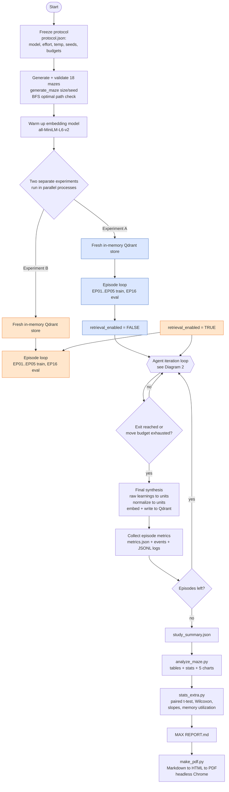
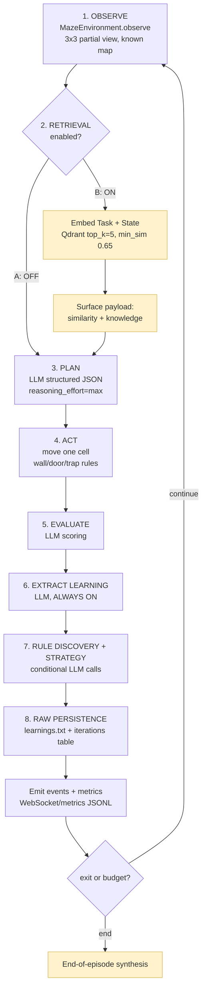
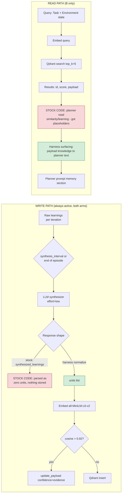
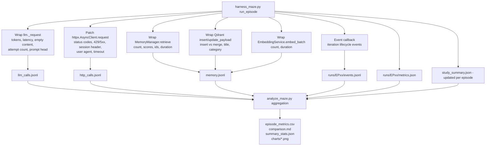

# Persistent-Learning Test Workflow & Tech Stack

Companion to `REPORT.md` (Persistent Maze Learning Benchmark, 5×5 phase, Memory OFF vs ON).
Everything below describes **exactly how the experiment was executed** and **what it ran on**.

---

## 1. End-to-End Experiment Workflow



**The single controlled difference:** `use_persistent_learning` (retrieval) = `False` (A) vs `True` (B).
Learning, storage, environment, mazes, prompts, model, temperature, budgets and instrumentation are identical in both arms.

---

## 2. Agent Iteration Loop (per action)



**Per-iteration budget breakdown (one episode, one maze):** 1 observe · 0–1 retrieval+embed (B only) · 1 planner call · 1 environment action · 1 evaluator call · 1 learning-extraction call · 0–2 rule/strategy calls. Measured average: **~4.9 LLM calls per iteration**.

---

## 3. Memory Lifecycle (write path + read path)



**Documented stock defects (repaired harness-side, identically in both arms):**

| # | Defect | Code location | Effect before repair |
|---|---|---|---|
| 1 | Synthesis prompt asks `synthesized_learnings`, parser accepts `units` only | `prompts.py:247-249` vs `synthesis.py:60` | 0 memory writes ever |
| 2 | Planner reads `similarity`/`learning`, retriever returns `{id, score, payload}` | `experiment_planner.py:104-108` | memories render as `[0.00] ?` |
| 3 | 429 retry exhaustion returns `None` | `llm_provider.py:161-183` | `NoneType` crash in evaluator/extractor |
| 4 | Max-effort synthesis generates 20k–41k reasoning tokens | gateway/upstream | HTTP 500, writes lost |
| 5 | `source_iterations` list vs int on merge | `memory_manager.py:66` | latent merge crash |

---

## 4. Instrumentation & Data Collection Flow



**Metric → source mapping:**

| Metric | Source |
|---|---|
| Success, moves, invalid/repeated moves, cells visited/seen, penalties | `MazeEnvironment.episode_metrics()` (in-process) |
| Wall-clock duration | perf_counter around `orchestrator.run()` |
| Iterations/actions | orchestrator state + `iteration_started` events |
| LLM calls, latency, prompt/completion/reasoning tokens, empty content | `llm_calls.jsonl` wrapper |
| HTTP statuses, retries | `http_calls.jsonl` wrapper |
| Retrieval count/scores/ids, write inserts/merges, embeddings, store size | `memory.jsonl` wrappers + Qdrant `get_stats()` |
| Learnings created, rules, strategies, snapshots, synthesis | event stream (`events.jsonl`) |
| Raw learnings (human-readable) | `storage/<run>/tasks/<id>/learnings.txt` |
| Per-iteration DB rows | `iterations` table (SQLite) |

---

## 5. Episode & Experiment Layout

```mermaid
gantt
    title Episode timeline (both arms in parallel)
    dateFormat  HH:mm
    axisFormat  %H:%M
    section Experiment A - OFF
    EP01 5x5 seed1001      :a1, 19:30, 18m
    EP02 seed1002          :a2, after a1, 9m
    EP03 seed1003          :a3, after a2, 15m
    EP04 seed1004          :a4, after a3, 11m
    EP05 seed1005          :a5, after a4, 9m
    EP16 unseen seed9001   :a6, after a5, 13m
    section Experiment B - ON
    EP01 5x5 seed1001      :b1, 19:30, 8m
    EP02 seed1002          :b2, after b1, 15m
    EP03 seed1003          :b3, after b2, 8m
    EP04 seed1004          :b4, after b3, 11m
    EP05 seed1005          :b5, after b4, 13m
    EP16 unseen seed9001   :b6, after b5, 14m
```



- **Training:** 5×5, seeds 1001–1005 (identical in both arms).
- **Unseen evaluation:** 5×5, seed 9001 (never used in training).
- **Move budget:** 30 moves/episode (trap penalties count against it; none in phase 1).
- **Partial observability:** agent sees its cell + surrounding 3×3; previously seen cells persist in its map, unseen cells are `?`.

---

## 6. Tech Stack (in-depth)

### 6.1 Compute / baseline environment

| Component | Detail |
|---|---|
| OS | Microsoft Windows 11 Home Single Language, 10.0.26200 (build 26200) |
| Shell / orchestration | Windows PowerShell 5.1.26100.9444 (`Start-Process cmd /c` for detached parallel arms) |
| CPU | AMD Ryzen 5 3550H (4C/8T) |
| GPU | NVIDIA GeForce GTX 1650, 4096 MiB, driver 616.56 (idle during study; embeddings ran on CPU) |
| RAM | 7.4 GB |
| Interpreter | CPython **3.14.0** (venv at `backend/venv`) |
| Process model | One OS process per experiment arm (A and B in parallel), each with its own SQLite DB + storage dir; all runs sequential within an arm |

### 6.2 Host application (system under test)

| Layer | Technology / version |
|---|---|
| API framework | FastAPI 0.141.1 (+ Uvicorn 0.53.0) |
| ORM / DB | SQLAlchemy 2.0.54 · aiosqlite 0.22.1 (async SQLite, Python stdlib `sqlite3` engine) |
| Migrations | Alembic 1.20.0 (tables created via `Base.metadata.create_all` in study DBs) |
| Validation / config | Pydantic 2.13.5 · pydantic-settings 2.15.0 |
| Auth (app, unused in study) | python-jose 3.5.0 · passlib 1.4 with bcrypt |
| HTTP client | httpx 0.28.1 (async) |
| Vector store | qdrant-client 1.19.1, in-memory mode (`:memory:`), cosine distance, 384-d |
| Embeddings | sentence-transformers 6.0.1 · `all-MiniLM-L6-v2` · PyTorch 2.14.0 (CPU) |
| Agent core | Custom `AgentOrchestrator` (iteration loop, sub-agents: TaskAnalyzer, ExperimentPlanner, ResultEvaluator, LearningExtractor, RuleDiscoveryEngine, StrategyManager, LearningSynthesizer) |
| Environment | `MazeEnvironment` (implemented for this benchmark): 5×5–7×7, S/E/./#/K/D/T, partial observability, deterministic seeds, key-before-door, trap +5 moves |
| Raw learning persistence | `RawLearningLogger` (`learnings.txt` per task) · JSON snapshots · SQLite `iterations` table |
| Realtime events | In-process event bus (no Redis in local mode) |

### 6.3 LLM provider (inference)

| Item | Detail |
|---|---|
| Provider | **OpenCode Go** (`opencode-go`) |
| Endpoint | `https://opencode.ai/zen/go/v1/chat/completions` (OpenAI-compatible) |
| Model | **`deepseek-v4.1-flash`** (reasoning model; 1,000,000-token context; up to 384k output) |
| Auth | Bearer key read at runtime from `~/.local/share/opencode/auth.json` (never written to logs) |
| Required header | `x-opencode-session: <task_id>` (stable per episode for routing/caching) |
| Client identity | `User-Agent: ala-maze-study/1.0` |
| Reasoning effort | `max` for all agent decision calls (planner/evaluator/extractor/rules/strategy); **`low` for synthesis batches** (documented workaround for upstream HTTP 500 on 20k–41k-token generations) |
| Temperature | 0.7 |
| Retry policy | Harness: up to 3 attempts on HTTP 500/502/503/504 (2s, 4s backoff); provider: built-in 429 handling |
| Request timeout | 300 s per call (harness override) |
| Notional price | $0.15/M input · $0.60/M output (off-peak, promotional); subscription billing applies |

### 6.4 Instrumentation layer (harness)

| Instrument | Mechanism | Output |
|---|---|---|
| LLM accounting | Instance-level wrap of provider `_request` (no app-source changes) | `llm_calls.jsonl`: tokens (incl. reasoning), latency, prompt head/chars, empty-content flag, attempts |
| Transport accounting | Runtime patch of `httpx.AsyncClient.request` | `http_calls.jsonl`: method, URL, status, duration, errors; header injection for zen |
| Memory accounting | Wraps on `retrieve_relevant_memories`, `qdrant_store.insert`/`update_payload`, `embedding_service.embed_batch` | `memory.jsonl`: retrieval counts/scores/ids, insert vs merge, embedding counts/durations |
| Event capture | Async event callback passed into the orchestrator | `runs/EPxx/events.jsonl`: full iteration lifecycle |
| Episode metrics | `MazeEnvironment.episode_metrics()` + orchestrator state | `runs/EPxx/metrics.json` |
| Run aggregation | Per-episode append | `study_summary.json` |

### 6.5 Analysis & reporting stack

| Tool | Version | Role |
|---|---|---|
| Python (stdlib) | 3.14 | CSV/JSON aggregation, statistics |
| NumPy | 2.5.3 | Arrays, linear slopes |
| SciPy | 1.18.1 | Paired t-test, Wilcoxon signed-rank |
| Matplotlib | 3.11.2 | 5 charts (trends, quality, resources, memory activity, unseen eval) |
| Markdown | 3.10.3 | REPORT.md → HTML (tables, fenced code, TOC ids) |
| Headless browser | Google Chrome 140+ (`--headless=new --print-to-pdf`) | Styled HTML → PDF (A4, charts embedded as base64) |
| pypdf | 6.19.0 | PDF verification (page count, embedded images) |
| PowerShell | 5.1 | Process supervision, log polling, artifact checks |

### 6.6 Repository / artifact layout

```
autonomous-learning-agent/
├─ backend/
│  ├─ venv/                                  # CPython 3.14 study runtime
│  ├─ storage/study_a_v3.db, study_b_v3.db   # isolated SQLite per arm
│  └─ app/
│     ├─ agents/orchestrator.py              # iteration loop
│     ├─ agents/synthesis.py                 # synthesizer (defect #1 site)
│     ├─ agents/experiment_planner.py        # memory rendering (defect #2 site)
│     ├─ agents/prompts.py                   # SYNTHESIS_V1 key mismatch (defect #1 site)
│     ├─ memory/{memory_manager,qdrant_store,retriever,embeddings}.py
│     ├─ models/llm_provider.py              # OpenAI-compatible client (defect #3 site)
│     └─ environments/maze_env.py            # NEW: benchmark environment
└─ experiments/maze_memory_study/
   ├─ harness.py                # instrumentation + shared runner utilities
   ├─ harness_maze.py           # per-experiment episode runner (A/B)
   ├─ validate_mazes.py         # maze generation/solvability validation
   ├─ analyze_maze.py           # tables, stats JSON, charts
   ├─ stats_extra.py            # paired tests, trends, memory utilization
   ├─ make_pdf.py               # REPORT.md → REPORT.pdf
   ├─ REPORT.md / REPORT.pdf / REPORT.html
   ├─ analysis/                 # episode_metrics.csv, comparison.md, summary_stats.json, charts/
   └─ results/maze5_{A,B}/
      ├─ protocol.json          # frozen experimental protocol
      ├─ study_summary.json     # all episode metrics
      ├─ llm_calls.jsonl / http_calls.jsonl / memory.jsonl / harness.log
      └─ runs/EP01..EP05-train, EP16-eval/{metrics.json,events.jsonl}
```

---

## 7. Exact Launch & Analysis Commands

```powershell
# --- Experiment A (Persistence OFF) and B (Persistence ON), launched in parallel ---
$root   = "C:\Users\chinm\.gemini\antigravity\scratch\autonomous-learning-agent"
$venv   = "$root\backend\venv\Scripts\python.exe"
$script = "$root\experiments\maze_memory_study\harness_maze.py"
$outA   = "$root\experiments\maze_memory_study\results\maze5_A"
$outB   = "$root\experiments\maze_memory_study\results\maze5_B"

$cmdA = "cd /d `"$root\backend`" && `"$venv`" `"$script`" --experiment A --scope 5x5 --tag maze5v3 --db study_a_v3 --out `"$outA`" > `"$outA\console.log`" 2>&1"
$cmdB = "cd /d `"$root\backend`" && `"$venv`" `"$script`" --experiment B --scope 5x5 --tag maze5v3 --db study_b_v3 --out `"$outB`" > `"$outB\console.log`" 2>&1"
Start-Process -FilePath "cmd.exe" -ArgumentList "/c", $cmdA -WindowStyle Hidden
Start-Process -FilePath "cmd.exe" -ArgumentList "/c", $cmdB -WindowStyle Hidden

# --- Validation, analysis, report ---
& $venv "$root\experiments\maze_memory_study\validate_mazes.py"
& $venv "$root\experiments\maze_memory_study\analyze_maze.py"
& $venv "$root\experiments\maze_memory_study\stats_extra.py"
& $venv "$root\experiments\maze_memory_study\make_pdf.py"
```

**Runtime environment variables (set by `harness_maze.py` before app import, isolating each arm):**

| Variable | Experiment A | Experiment B |
|---|---|---|
| `DATABASE_URL` | `sqlite+aiosqlite:///./storage/study_a_v3.db` | `…/study_b_v3.db` |
| `STORAGE_DIR` | `./storage/study_a_v3` | `./storage/study_b_v3` |
| `QDRANT_URL` | `:memory:` (fresh per process) | `:memory:` (fresh per process) |

---

## 8. Validity Controls Baked Into the Workflow

1. **Identical maze sequence** — seeds fixed before either arm starts; the same generator is deterministic.
2. **Paired design** — every training episode is compared against the same maze in the other arm (paired t-test/Wilcoxon).
3. **One variable only** — `retrieval_enabled`; learning/storage stay ON in both arms by design.
4. **Clean stores** — each arm starts with an empty in-memory vector store; no cross-contamination between experiments.
5. **Repairs applied to both arms** — the five defect workarounds are identical, so the contrast remains controlled (documented in `REPORT.md` §4.3).
6. **Everything timestamped and retained** — every LLM call, HTTP request, memory op, event and episode metric is preserved under `results/`; aborted pre-fix attempts are archived as defect evidence.
